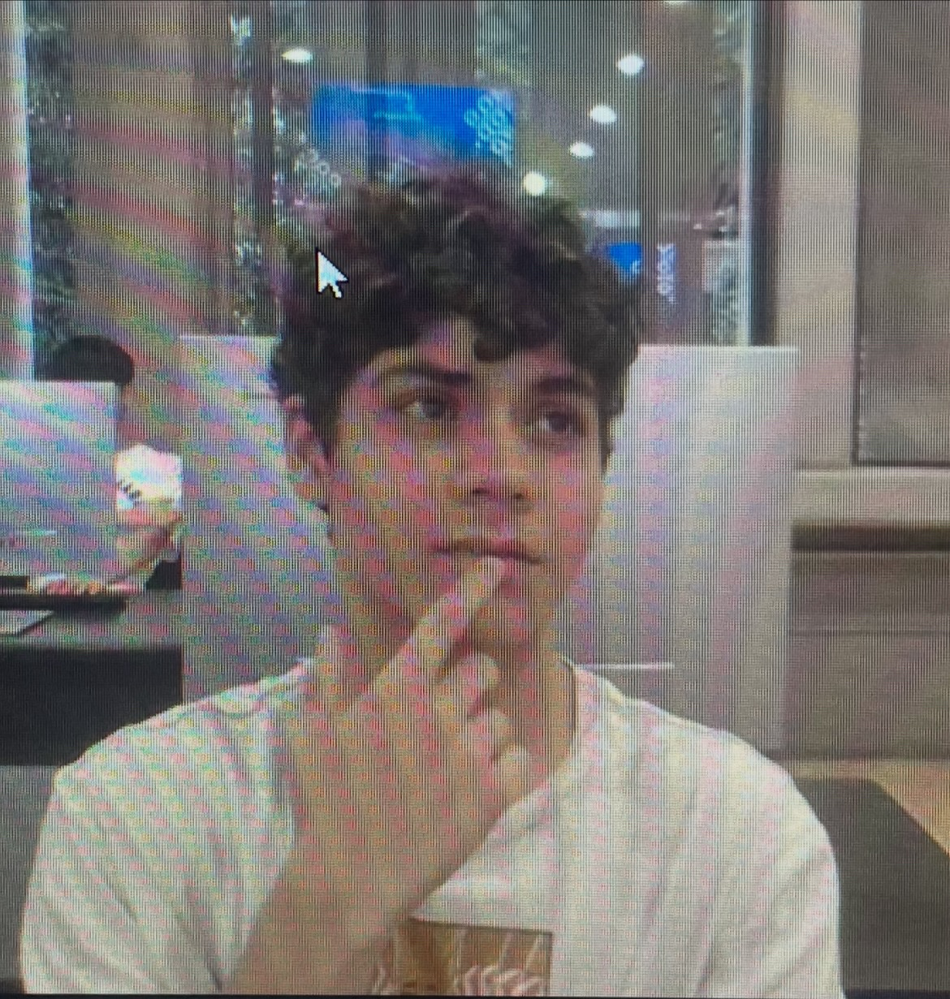

# portafolio mecatronica
hola soy Eduardo Gutierrez me meti a mecatronica porque se ma hace una carrera muy entetenida debido a todo el trabajo manual que conlleva y la mezcla que tiene entre programacion, electronica trabjos en madera cortado lazer e imprecion 3d

# *Programa 1*
en este programa logramos hacer que un led parpade a cierta velocidad aumentando el delay entre accion y accion
<a href="https://youtube.com/shorts/e3gQDac2c00?feature=share" target="_blank">Programa1 pt1</a>, de la misma manera con el uso de delay y una alineacion adecuada se logra que dos leds turnen su encendido
[Programa1 pt2](https://youtube.com/shorts/mtbwGQFyiNU?feature=share)

# *programa 2*
en esta practica empesamos el uso de los arduinos con un codigo basico que marca el encendido o apagado mediante el uso de un push button 
[Programa 2 pt1](https://youtube.com/shorts/GfS_jjcDDDw?feature=share)
 durante esta misma practica co  el uso de el arduina y una aplicacion de celular logramos enlazar los aparatos para permitir que una accion pudiera ser transferida de el celular al arduino 
 [Programa 2 pt2](https://youtube.com/shorts/AIXq_eSvNKI?feature=share)