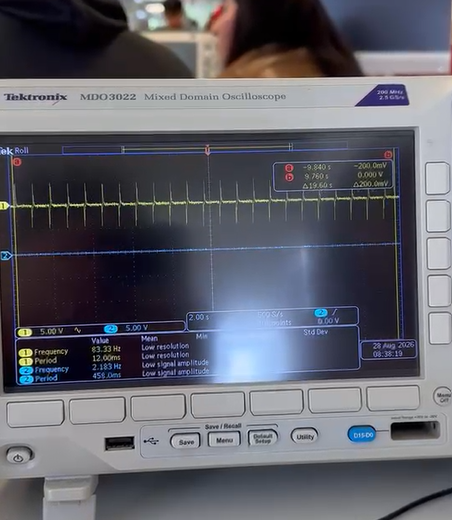
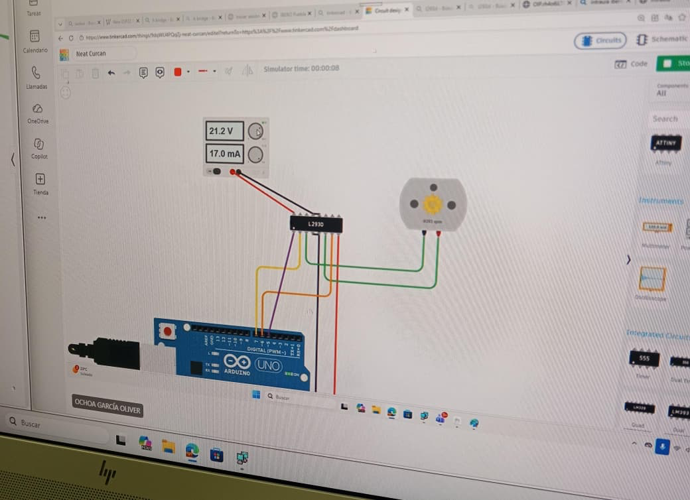

# Portafolio Mecatrónica

Hola, soy Eduardo Gutierrez. Me metí a mecatrónica porque se me hace una carrera muy entretenida debido a todo el trabajo manual que conlleva y la mezcla que tiene entre programación, electrónica, trabajos en madera, corte láser e impresión 3D.


Esta pagian web la cree desde visual estudio con una conexion directa de GitHub, al crear un nuevo repertorio usar ese link y pegarlo aqui, use este grupo de comandos diferentes
``` codigo
```git
git clone
git add .
git commit -m "adicion"
git push
```


## Programa 1
En este programa logramos hacer que un LED parpadee a cierta velocidad aumentando el delay entre acción y acción. 

Que elementos utilise en esta practica?

- Item A
    * Subitem A.1
    * Subitem A.2
    * temporisador 555
    * Capacitor electrolítico de 33 μF
    * Capacitor electrolitico de 10 μF
    * Capacitor cerámico de 10 nF
    * Resistencia 1KΩ
    * Resistencia 15KΩ
    * Resistencia 220 Ω
    * Led azul
    * Cables de puente
    * Protoboard
    ---
En esta practica logre aprender los basicos de la electronica el funcionamiento de microchips pricipalmente t como usar sus entradas y salidas y como varian segun cada uno, aqui se puede ver la protoboard armada y el funcionamiento de la misma 
<iframe width="560" height="315" src="https://www.youtube.com/embed/hHBStf6Kops?si=Bls5IaymzCASYvMG" title="YouTube video player" frameborder="0" allow="accelerometer; autoplay; clipboard-write; encrypted-media; gyroscope; picture-in-picture; web-share" referrerpolicy="strict-origin-when-cross-origin" allowfullscreen></iframe>
Aqui se puede observar como se ve el led parpadeante en un osiloscopio



## Programa 2
En esta práctica empezamos el uso de los Arduinos con un código básico que marca el encendido o apagado mediante el uso de un push button junto con la conexion de el bluetooth mediante el celular
que elementos utilise? 

* ESP32
* Protoboard
* 2 LEDs azules
* 2 resistencias de 220
* Botón pulsador
* Cables de puente
* Cable USB

En la primera parte de esta practica usamos el arduino para proframas un boton simple de encendido y aoagado en el siguinete video podemos ver su funcionamiento

<iframe width="560" height="315" src="https://www.youtube.com/embed/0KOjz-05ZhY?si=6q-aqK4tgEJDStXn" title="YouTube video player" frameborder="0" allow="accelerometer; autoplay; clipboard-write; encrypted-media; gyroscope; picture-in-picture; web-share" referrerpolicy="strict-origin-when-cross-origin" allowfullscreen></iframe>

Durante esta misma práctica, con el uso del Arduino y una aplicación de celular, logramos enlazar los aparatos para permitir que una acción pudiera ser transferida del celular al Arduino:
<iframe width="560" height="315" src="https://www.youtube.com/embed/7Wo4b67l00A?si=cOA1RjMG9BPsNcPy" title="YouTube video player" frameborder="0" allow="accelerometer; autoplay; clipboard-write; encrypted-media; gyroscope; picture-in-picture; web-share" referrerpolicy="strict-origin-when-cross-origin" allowfullscreen></iframe>

Aquí se puede observar el código que fue usado:

``` code
#include <BTAddress.h>
#include <BTAdvertisedDevice.h>
#include <BTScan.h>
#include <BluetoothSerial.h>

BluetoothSerial Mi_tel;

void setup() {
  Mi_tel.begin("Edu");
  Mi_tel.setTimeout(20);
  Serial.begin(9600);
  pinMode(32, OUTPUT);
}

void loop() {
  if(Mi_tel.available()){
    String mensaje = Mi_tel.readStringUntil('\n');
    mensaje.trim();
    if(mensaje == "OFF"){
      digitalWrite(32,1);
    }
    if(mensaje == "ON"){
      digitalWrite(32,0);
    }
  }
}
```
# programa 3
en esta practica aprendimos a usar tinkercad y vimos las bases de el controlamiento de motores basicos y servo motores hicimos dos practicas la primera la mas basica fue hacer que un motor cambiara de direccion  su rotacion, tambien aprendimos un nuevo tipo de microcontrolador el puente h el cua es el responsable de poder invertir las direcciones de los motores.


en el segundo sistema hicimo s que el arduino lograra cambiar la direccion de 3 motores dos normales y un cervo motor, la diferencia entre el servomotor y el normal es que tiene una mayor exactitud y precision a la hora de marcarle pautas 


este fue el codigo que utilisamos
```
#include <Servo.h>
Servo oliver_dame_de_baja;
void adelante(){
  digitalWrite(6, HIGH);
  digitalWrite(7, LOW);
  digitalWrite(2, HIGH);
  digitalWrite(3, LOW);
}
void atras (){
  digitalWrite(7, HIGH);
  digitalWrite(6, LOW);
  digitalWrite(3, HIGH);
  digitalWrite(2, LOW);
}
void der (){
  digitalWrite(6, HIGH);
  digitalWrite(7, LOW);
  digitalWrite(3, HIGH);
  digitalWrite(2, LOW);
}
void izq (){
  digitalWrite(7, HIGH);
  digitalWrite(6, LOW);
  digitalWrite(2, HIGH);
  digitalWrite(3, LOW);
}
void setup()
{
  //SERVO
  oliver_dame_de_baja.attach(9);

  //MOTOR
  pinMode(6, OUTPUT); //OUT1
  pinMode(7,OUTPUT); //OUT2
  pinMode(3, OUTPUT); //OUT1
  pinMode(2,OUTPUT); //OUT2

  digitalWrite(5, HIGH);
  digitalWrite(1, HIGH);
}

void loop(){
  oliver_dame_de_baja.write(0);
  delay(1000);
  oliver_dame_de_baja.write(90);
  delay(1000);
  oliver_dame_de_baja.write(180);
  delay(1000);
  adelante();
  delay(1000);
  atras();
  delay(1000);
  der();
  delay(1000);
  izq();
  delay(1000);
}
